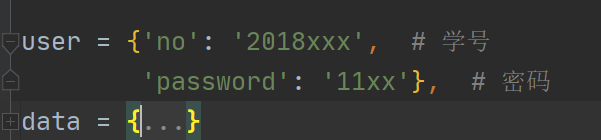
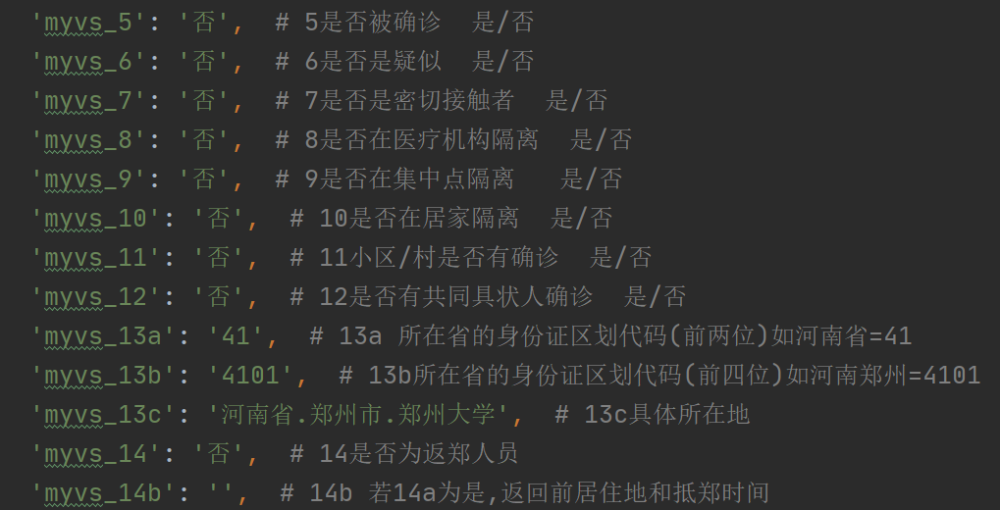

#郑州大学健康打卡自动脚本(Python)
## 0.前言
对于大多数人来说每天的健康打卡几乎没有什么变化,我就想试试能不能做到自动打卡,就算是练手
Python以及云服务器.所以这个脚本仅供学习交流,下面我会列出**学习**此脚本所涉及的基础知识.
- Python,包括基础语法(列表,字典,函数,正则表达式)以及requests(模拟登录)
,BeautifulSoup(HTML解析)库的知识
- 计算机网络,了解基础的Chrome浏览器调试工具以及发送请求的数据格式等
- 云服务器,能在云服务器上运行Python代码并能设置定时任务(不了解的可以看一下我写的一篇博客
[玩转服务器]()(暂未更新) )

如果只是浅层学习的话,会云服务和Python就可以
## 1.浅层学习说明
把zzu_jssk.py文件下载到本地之后,  
安装equests(模拟登录),BeautifulSoup(HTML解析)库,  
并更改user和data数据变成你自己的数据
user和data均为字典,user是你的登录名和密码,
data是最后填报的数据,每一项数据代表的含义都注释了,和填报的顺序完全一致
可自行对比查看

别的数据无特别情况无需变动
之后把代码上传到云服务器上(如果你的电脑永不关机,也可以,但是不推荐),设置一个定时任务,
然后就可以自动的帮你打卡了.

## 2.深入学习说明
总体的实现思路就是通过Chrome的调试工具获取登录所需要的信息以及信息格式  
之后用Python的requests库实现模拟登录,最后把代码放在云服务器上,设置好定时任务即可
技术要点
- 通过调试工具获取到数据表单提交时候的表头和数据
- 通过requests库对表头和数据安装格式组装,并模拟登录,需要注意的是把所有的返回的
response设置编码格式为utf-8,不然会出现乱码,影响后续
- 用户登录之后会有一个超链接跳转到**选择填报人和填报类型**界面,因此需要
获取到这个超链接,把response返回的数据转换成文本格式就是返回的含有超链接的HTML代码,
然后使用正则表达式获取到此超链接
- 选择填报人和填报类型界面的模拟登录思路和第一个一致,但需要获取到登录的session信息
供学校服务器验证,通过BeautifulSoup库的HTML解析功能获取到session信息
,并存入到info这个字典中供后续使用,但不需要额外获取超链接,提交之后
就是**填写上报表格**页面
- **填写上报表格**页面需要获取用户需要提交数据(data)以及session验证信息组装之后
,提交到服务器
- 最后一步就是上传到云服务器,先购买一个云服务器,选择操作系统,以centos7为例需要安装
Python3,并更改自带的Python2的参数.之后安装宝塔面板作为可视化的后台界面
,接着设置定时任务,执行脚本.
## 3.项目初衷
只是为了练手Python和云服务器,顺手做了这样一个项目,仅供学习.
之所以没有采用在Python代码中设置定时任务,因为打卡每天只要一次,如果在Python中
设置了定时任务,那么Python的代码需要一直运行,别说是自己电脑了,就是服务器这么做也太
浪费资源了.直接在操作系统级别设置定时任务不香嘛?
## 4.项目改进
考虑到有的同学需要截图,如果后续有需要,可以打完卡之后自动获取到打卡成功的界面.
另外这个项目会持续跟进的,如果学校有了变动,会尽快升级的,毕竟我自己也要学习.
最后转载请标明出处,禁止牟利,低调学习使用.

