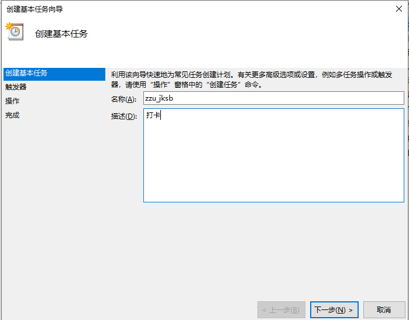

#为了响应学校疫情防控办的号召，请各位同学自觉遵守健康打卡规定，不要耍小聪明
[郑州大学新型肺炎防控专题网站](http://www5.zzu.edu.cn/yqfk/)
## 2022-5-10
学校加了8.您是否按要求参加了核酸检测，已经修复，推测是`"myvs_9": "y"`
## 2022-5-9 
学校加了8.您是否按要求参加了核酸检测，这个目前格式还不确定，根据经验推测是`myvs_8`，有需要可自行修改测试
## 2022-4-18
修复了refer异常，以后作设备校验可以参考用refer、host等，代码素养又得到了提高呢
但是`data`中有个`fun18`属性，这个属性暂时不知道是干嘛的，但参数经常变，合理怀疑是类似于
郑州大学通行码一样，每天变一下数字，方便后台/保安做检验的。

**所以应该还不是很稳定**
## 2022-4-11
~~这个脚本暂时没法用，使用时会显示，个人猜测是加了参数校验~~
# 郑州大学健康打卡自动脚本(Python)

**现在学校开始识别IP地址了，
虽然我感觉早就应该识别了，如果服务器所在地和自己不在一个市的，
就不能挂在服务器上了，可以考虑挂在自己家的路由器（性能需要好一点的，K2P永远的神）上，
树莓派不知道可不可以，或者自己电脑每天开着机。**

**下面会有如何用普通的win10电脑设置定时任务的教程，有需要可以自行查阅。** 并且导出了设置的脚本，可以直接导入自己的计算机中，修改程序位置即可。

打卡系统识别的IP有的时候是不准确的，在使用数据打卡的时候，有时候只会显示到某个省，市是识别不出来的（移动这样情况比较多），具体可以自己在浏览器输入"IP"
查一下，看看自己的IP能识别到哪个级别，如果是这种情况的话，默认会认为在省会，所以如果所在省的省会有公有的云服务器资源的话，还是可以的，问就是家里没有WIFI（WIFI就别想了，识别的很准确，基本上能到县级，但学校只获取到市级）

## 0.前言

对于大多数人来说每天的健康打卡几乎没有什么变化,我就想试试能不能做到自动打卡,就算是练手 Python以及云服务器.所以这个脚本仅供学习交流,下面我会列出**学习**此脚本所涉及的基础知识.

- Python,包括基础语法(列表,字典,函数,正则表达式)以及requests(模拟登录)
  ,BeautifulSoup(HTML解析)库的知识
- 计算机网络,了解基础的Chrome浏览器调试工具以及发送请求的数据格式等
- ~~云服务器,能在云服务器上运行Python代码并能设置定时任务(不了解的可以看一下我写的一篇博客
  [玩转服务器](https://editor.csdn.net/md/?articleId=107212739) )~~

如果只是浅层学习的话,会云服务和Python就可以 如果有学到,请给个star

## 1.浅层学习说明

把zzu_jssk.py文件下载到本地之后, 安装requests(模拟登录),BeautifulSoup(HTML解析)库, 并更改user和data数据变成你自己的数据

user和data均为字典,user是你的登录名和密码, data是最后填报的数据,每一项数据代表的含义都注释了,和填报的顺序完全一致

可自行对比查看

别的数据无特别情况无需变动 之后把代码上传到~~云服务器上~~ 自己电脑上,设置一个定时任务, 然后就可以自动的帮你打卡了.

## 1.1 win10设置定时任务教程

- 在win10右下角搜索**计算机管理**

- 选择**任务管理程序**->**任务管理程序库**->**Microsoft**->**Windows**,并单击**Windows**

  
- 右键选择**创建基本任务**，或者在右边栏找到**创建基本任务**

  
- **名称**和**描述**可以随意，这里以下图的名称和描述为例，点击下一步

  
- 频率选择**每天，下一步

  
- 开始时间选择一个，你们辅导员催你打卡的时间之前，👀️ 。这里以0:05为例，点击下一步

  
- 选择启动程序（其实也没得选，因为别的都弃用了，可以自己实现一个），选择下一步

  
- 重点来了，这里的**程序或脚本**选择你本地的python.exe文件的路径，如果不知道，可以去环境变量里查，如果还不知道，用everything之类的工具搜索一下python.exe吧。添加参数选择打卡的.py文件。这里的意思相当于是，你在cmd中输入 E:\Python37\python.exe E:\PythonProject\zzu_jksb.py。是真正的启动脚本。点击下一步

  
- 至此，检查一下，看有没有问题，触发器就是启动时间和频率，操作就是执行脚本。没有问题就完成即可。图中的画框部分建议勾上，然后对属性进行设置。当然不勾也行，后面也有办法打开属性设置对话框。

  
- 剩下的步骤其实设置与否并不重要，但为了更稳定，建议设置上。具体如图

  

  

  

## 2.深入学习说明

总体的实现思路就是通过Chrome的调试工具获取登录所需要的信息以及信息格式 之后用Python的requests库实现模拟登录,最后把代码放在云服务器上,设置好定时任务即可 技术要点

- 通过调试工具获取到数据表单提交时候的表头和数据
- 通过requests库对表头和数据安装格式组装,并模拟登录,需要注意的是把所有的返回的 response设置编码格式为utf-8,不然会出现乱码,影响后续
- 用户登录之后会有一个超链接跳转到**选择填报人和填报类型**界面,因此需要 获取到这个超链接,把response返回的数据转换成文本格式就是返回的含有超链接的HTML代码, 然后使用正则表达式获取到此超链接
- 选择填报人和填报类型界面的模拟登录思路和第一个一致,但需要获取到登录的session信息 供学校服务器验证,通过BeautifulSoup库的HTML解析功能获取到session信息
  ,并存入到info这个字典中供后续使用,但不需要额外获取超链接,提交之后 就是**填写上报表格**页面
- **填写上报表格**页面需要获取用户需要提交数据(data)以及session验证信息组装之后 ,提交到服务器
- 最后一步就是上传到云服务器,先购买一个云服务器,选择操作系统,以centos7为例需要安装 Python3,并更改自带的Python2的参数.之后安装宝塔面板作为可视化的后台界面 ,接着设置定时任务,执行脚本.

## 3.项目初衷

只是为了练手Python和云服务器,顺手做了这样一个项目,仅供学习. 之所以没有采用在Python代码中设置定时任务,因为打卡每天只要一次,如果在Python中
设置了定时任务,那么Python的代码需要一直运行,别说是自己电脑了,就是服务器这么做也太浪费资源了.直接在操作系统级别设置定时任务不香嘛?

## 4.项目改进

考虑到有的同学需要截图,如果后续有需要,可以打完卡之后自动获取到打卡成功的界面. 另外这个项目会持续跟进的,如果学校有了变动,会尽快升级的,毕竟我自己也要学习. 最后转载请标明出处,禁止牟利,低调学习使用哈.
